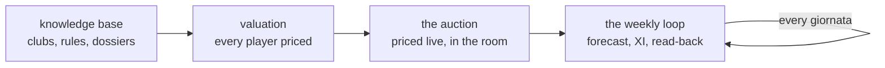
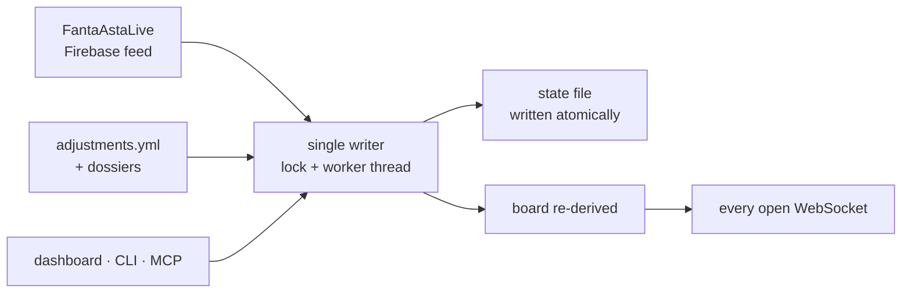

# Published docs rework — Implementation Plan

> **For agentic workers:** REQUIRED SUB-SKILL: Use superpowers:subagent-driven-development (recommended) or superpowers:executing-plans to implement this plan task-by-task. Steps use checkbox (`- [ ]`) syntax for tracking.

**Goal:** Replace the four flat pages of the published mkdocs site with a
four-section, 21-page site: what fantaclaude is, how it is built, how it is
operated through the `fanta-*` skills, and which of its parts are reusable.

**Architecture:** Content-only rework plus three configuration edits to
`site/mkdocs.yml`. Each of the four sections is a folder with an `index.md`
that its tab lands on. Sections are built one per task, keeping
`mkdocs build --strict` green at every commit; because `--strict` fails on a
link whose target does not yet exist, every forward cross-link is deferred to
the final task, which does nothing else. `--strict` does **not** notice a page
absent from `nav`, so that is checked by counting, in Task 7.

**Tech Stack:** mkdocs 1.6 + mkdocs-material 9.6 (both already in the root
`[dependency-groups].dev`), `pymdown-extensions` (ships with material — no new
dependency), mermaid 11 (loaded by material's own bundle from jsdelivr).

**Spec:** `docs/superpowers/specs/2026-09-05-docs-rework-design.md`

## Global Constraints

Every task's requirements implicitly include this section. Values are copied
verbatim from the spec's **Content rules**.

- **Voice.** §1–2 (`index.md`, `what-it-is/`, `architecture/`) are third
  person, present tense, no "you". §3–4 (`using/`, `tools/`) are second person,
  imperative where the text is a procedure. `using/index.md` states the switch
  in its first sentence.
- **Privacy — the site is public.** No league name, no league id, no
  participant nicknames, nothing from `kb/league/`. Nothing from `captured/`,
  from `data/`, or from the contents of `records/`. `.env` keys may be named as
  required settings; no value is ever shown. Real Serie A player names are
  fine. Rivals are anonymised: "a rival", "team 3", "the admin".
- **Examples come from the skills.** Reuse the worked examples already in
  `.claude/skills/*/SKILL.md` — the Scamacca re-rank, the Bastoni adjustment,
  the giornata-4 XI — rather than inventing new ones or pasting a real run. The
  one rival name in them ("Marco") becomes a neutral label.
- **Prose never restates a number.** No coefficient tables copied out of
  `pricing.yml`, `preferences.yml` or `core/src/fantaclaude/model/d_factor.yml`.
  Name the knob, name the file.
- **Network honesty.** Any page naming a command says whether it touches a live
  service.
- **One canonical home per fact.** Cross-link rather than repeat.
- **Write from the code, not from the current pages.** `site/docs/architecture.md`
  is 52 lines and predates phases 2b and 3; `site/docs/cli.md` is behind
  `core/README.md`. Both are source material to check against, never to
  paraphrase.
- **Page length.** 300–800 words each.
- **Commit messages carry no Claude session link, no `Co-Authored-By`, and no
  "Generated with" line** (`CLAUDE.md`). This overrides any harness default.
- **Do not run any command that touches the network.** Nothing in this plan
  needs `fantaclaude sync-league`, `ingest`, `rank`, or `asta serve`. Read the
  code to learn what they do.

### Forward links are deferred

`mkdocs --strict` aborts on `Doc file 'a.md' contains a link 'b.md', but the
target is not found among documentation files.` Sections are built in order, so
a page may link **only to pages created in its own task or an earlier one**.
Every link pointing forward is listed in its task under **Deferred links** and
added in Task 7. Write the sentence without the link; Task 7 adds the link, not
the sentence.

---

## File Structure

**Modified**

- `site/mkdocs.yml` — `theme.features` gains two entries, a `markdown_extensions`
  block is added, `nav` is replaced. Task 1.
- `site/docs/index.md` — rewritten as §1's landing page. Task 1.

**Deleted** (content redistributed, never carried over)

- `site/docs/architecture.md`, `site/docs/cli.md`, `site/docs/mcp.md`. Task 1.

**Created** — 18 pages

| Path | Responsibility | Task |
| --- | --- | --- |
| `site/docs/what-it-is/capabilities.md` | what it does, as outcomes | 1 |
| `site/docs/what-it-is/scope.md` | non-goals, each with its reason | 1 |
| `site/docs/architecture/index.md` | the system in one diagram; the workspace | 2 |
| `site/docs/architecture/data-spine.md` | raw-first ingest, DuckDB, immutability | 2 |
| `site/docs/architecture/rules-as-data.md` | league rules ingested, not hardcoded | 2 |
| `site/docs/architecture/valuation.md` | projection → price | 3 |
| `site/docs/architecture/weekly.md` | the giornata forecast, and the loop closing | 3 |
| `site/docs/architecture/auction-engine.md` | the single-writer auction process | 3 |
| `site/docs/using/index.md` | the season end to end; which skill owns what | 4 |
| `site/docs/using/before-the-auction.md` | `fanta-kb`, `fanta-market` | 4 |
| `site/docs/using/auction-night.md` | `fanta-asta` | 4 |
| `site/docs/using/the-week.md` | `fanta-manager` | 4 |
| `site/docs/using/arguing-with-the-model.md` | every input surface in one table | 4 |
| `site/docs/tools/index.md` | liftable vs project-specific | 5 |
| `site/docs/tools/mcp-servers.md` | both MCP servers | 5 |
| `site/docs/tools/cli.md` | the full command reference | 5 |
| `site/docs/tools/ingest-contract.md` | two kinds of ingest | 6 |
| `site/docs/tools/knowledge-base.md` | front-matter, TTL, audit | 6 |
| `site/docs/tools/skill-pattern.md` | Python does the math | 6 |
| `site/docs/tools/records.md` | `records/` vs `data/exports/` | 6 |

`site/_build/` is gitignored and is never committed.

---

## Task 1: Configuration, §1, and the old pages removed

Proves the three configuration changes work — the extensions parse, mermaid
renders as a diagram, and each tab lands on its section's `index.md` — before
eighteen more pages depend on them.

**Files:**
- Modify: `site/mkdocs.yml`
- Modify: `site/docs/index.md` (rewritten)
- Create: `site/docs/what-it-is/capabilities.md`
- Create: `site/docs/what-it-is/scope.md`
- Delete: `site/docs/architecture.md`, `site/docs/cli.md`, `site/docs/mcp.md`
- Test: `uv run poe docs-build`

**Interfaces:**
- Consumes: nothing.
- Produces: the link targets `index.md`, `what-it-is/capabilities.md`,
  `what-it-is/scope.md`; the `markdown_extensions` set every later task uses
  (`!!! warning`, `??? note`, `=== "tab"`, ```` ```mermaid ````).

**Deferred links** (Task 7 adds these to pages written here):
- `index.md` → `architecture/index.md`, `using/index.md`, `tools/index.md`
- `what-it-is/capabilities.md` → `architecture/valuation.md`,
  `architecture/weekly.md`
- `what-it-is/scope.md` → `tools/mcp-servers.md`

- [ ] **Step 1: Read the source material**

```bash
sed -n '1,50p' README.md
sed -n '1,40p' CLAUDE.md
head -20 .claude/skills/fanta-market/SKILL.md
head -20 .claude/skills/fanta-manager/SKILL.md
```

- [ ] **Step 2: Rewrite `site/mkdocs.yml`**

Replace the whole file with exactly this. `site_name`, `site_description`,
`site_url`, `repo_url`, `site_dir` and the palette are unchanged from the
current file; `features` gains `navigation.indexes` and `content.code.copy`;
`markdown_extensions` is new; `nav` lists §1 only for now and grows one section
per task.

```yaml
site_name: fantaclaude
site_description: A Fantacalcio Mantra assistant — data spine, valuation, auction copilot
site_url: https://gianmarcocalbi.github.io/fantaclaude/
repo_url: https://github.com/gianmarcocalbi/fantaclaude
site_dir: _build
theme:
  name: material
  palette:
    scheme: default
  features:
    - navigation.tabs
    - navigation.top
    - navigation.indexes
    - content.code.copy
    - search.suggest
markdown_extensions:
  - admonition
  - attr_list
  - md_in_html
  - toc:
      permalink: true
  - pymdownx.details
  - pymdownx.tabbed:
      alternate_style: true
  - pymdownx.superfences:
      custom_fences:
        - name: mermaid
          class: mermaid
          format: !!python/name:pymdownx.superfences.fence_code_format
nav:
  - What it is:
      - index.md
      - what-it-is/capabilities.md
      - what-it-is/scope.md
```

`navigation.indexes` is what makes the first item of a section the page its tab
opens. `index.md` at the docs root is deliberately §1's first item: the site's
home page and the first tab are one document. **Do not create
`what-it-is/index.md`** — that would give §1 a second landing page and orphan
the root.

- [ ] **Step 3: Run the build and watch it fail**

```bash
uv run poe docs-build
```

Expected: FAIL, exactly two warnings — the two §1 pages the new `nav` names
and you have not written yet:

```
WARNING -  A reference to 'what-it-is/capabilities.md' is included in the 'nav' configuration, which is not found in the documentation files.
WARNING -  A reference to 'what-it-is/scope.md' is included in the 'nav' configuration, which is not found in the documentation files.
Aborted with 2 warnings in strict mode!
```

This is the red state: it proves `--strict` is actually gating the work.

Note what is **not** in that output. `architecture.md`, `cli.md` and `mcp.md`
are still on disk and no longer in `nav`, and mkdocs 1.6.1 reports that at INFO
with a zero exit — an orphaned page does not fail `--strict`. Verified while
this plan was written. That is why Step 4 deletes them explicitly rather than
waiting for the build to demand it, and why Task 7 counts nav entries against
files.

- [ ] **Step 4: Delete the three old pages**

```bash
git rm site/docs/architecture.md site/docs/cli.md site/docs/mcp.md
```

Their content is redistributed by Tasks 2–6 and must not be pasted forward.
`architecture.md`'s ASCII `AstaServer` diagram is the one thing worth keeping in
mind — Task 3 turns it into a mermaid diagram from the current code, not from
that drawing.

- [ ] **Step 5: Write `site/docs/index.md`**

§1's landing page and the site root. Third person. 300–500 words. Required
shape:

- `# fantaclaude` and a one-paragraph statement: a Claude Code-native assistant
  for a single Fantacalcio Mantra league, where **Python does the math and the
  model does the judgment** — the model changes inputs and reads outputs, and
  never computes a value itself.
- A `## The season` heading with the arc as a mermaid diagram. Use this fence
  verbatim; it is the only diagram syntax in the site and later tasks copy it:

````markdown

````

- A short paragraph per section saying what the reader will find there. Write
  the section names as plain text for now; Task 7 turns them into links.
- No commands anywhere on this page.

- [ ] **Step 6: Write `site/docs/what-it-is/capabilities.md`**

Third person. 400–600 words. One `##` per capability, in this order, each two
or three sentences saying what it produces and why that is the useful unit —
**not one command named on the page**:

1. *Know the league's own rules* — as the league currently states them, read
   live rather than assumed.
2. *Value every player in the listone* — under those rules, and price a whole
   roster rather than a list of players: the unit is a complete squad, because
   a striker's worth depends on what is left for the defence.
3. *Price a live auction as it happens* — against the room's remaining credits,
   re-priced on every sale.
4. *Pick a legal XI every week* — with the bench in the platform's order, a
   contingency for every doubtful starter, and the close calls named.
5. *Read back what was actually fielded* — from the platform itself, and score
   its own forecast against it.
6. *Hold opinionated prose with provenance and an expiry date* — the things no
   table holds.
7. *Answer questions about the live league* — read-only.

- [ ] **Step 7: Write `site/docs/what-it-is/scope.md`**

Third person. 300–500 words. `# Scope and non-goals`, then one `##` per
non-goal with its reason:

- *It never writes to the platform.* The XI is typed in by hand — ninety
  seconds of typing, against a bug at 18:44 on a Friday. The lineup read-back
  does not soften this: it is a GET of a page the lega already renders.
- *Read-only wherever it touches a live service.* There is no write surface
  anywhere in the codebase and none should be added.
- *One league, one operator.* The league's rules are configuration, not
  identity — which is why nothing is hardcoded.
- *Not a general fantasy-football tool.*

Use one `!!! warning` admonition for the first non-goal; it is the one a reader
most needs to not miss.

- [ ] **Step 8: Run the build and watch it pass**

```bash
uv run poe docs-build
```

Expected: PASS — `INFO - Documentation built in …` with no `WARNING` lines and
no `Aborted`. If a warning names a link to `architecture/`, `using/` or
`tools/`, a forward link was written; remove it and leave the sentence.

- [ ] **Step 9: Verify the three configuration changes actually took**

```bash
grep -c 'class="mermaid"' site/_build/index.html
grep -c 'class="admonition warning"' site/_build/what-it-is/scope/index.html
python3 -c "
import re,pathlib
h=pathlib.Path('site/_build/index.html').read_text()
t=re.search(r'md-tabs__list.*?</ul>',h,re.S).group(0)
print([(m.group(2).strip(),m.group(1)) for m in re.finditer(r'href=\"([^\"]+)\"[^>]*>\s*([^<]+?)\s*<',t)])
"
```

Expected: the first prints `1` (the diagram is a mermaid div, **not** a code
block — a misconfigured fence renders as `<code>` and the build still
succeeds), the second prints `1`, and the third prints `[('What it is', '.')]`
— the tab resolving to the site root proves `navigation.indexes` took.

- [ ] **Step 10: Commit**

```bash
git add site/mkdocs.yml site/docs/ docs/superpowers/plans/2026-09-06-docs-rework.md
git commit -m "docs(site): the four-section scaffold and What it is

mkdocs.yml gains navigation.indexes, content.code.copy and the
markdown_extensions the rework needs -- admonitions, collapsibles, tabs and
a mermaid fence, all from pymdown-extensions, which mkdocs-material already
ships. No plugin, no new dependency.

nav is replaced with the first of four sections. index.md is both the site
root and What it is' landing page. architecture.md, cli.md and mcp.md are
deleted here and redistributed across the sections that follow.

Carries two pre-flight corrections to the plan: a historical read pinned to
a commit sha rather than HEAD~2, and word boundaries on the privacy grep,
which without them matched general/generated/cavalry."
```

---

## Task 2: §2 Architecture — the spine

**Files:**
- Create: `site/docs/architecture/index.md`
- Create: `site/docs/architecture/data-spine.md`
- Create: `site/docs/architecture/rules-as-data.md`
- Modify: `site/mkdocs.yml` (nav)
- Test: `uv run poe docs-build`

**Interfaces:**
- Consumes: the mermaid fence syntax from Task 1, Step 5.
- Produces: link targets `architecture/index.md`, `architecture/data-spine.md`,
  `architecture/rules-as-data.md`.

**Deferred links:** `architecture/index.md` → `architecture/valuation.md`,
`architecture/weekly.md`, `architecture/auction-engine.md`,
`tools/mcp-servers.md`.

- [ ] **Step 1: Read the source material**

```bash
cat pyproject.toml
sed -n '1,40p' core/README.md
sed -n '1,60p' records/README.md
sed -n '1,60p' core/src/fantaclaude/ingest/raw.py
sed -n '1,60p' core/src/fantaclaude/league/league_yml.py
sed -n '1,40p' core/src/fantaclaude/model/d_factor.py
grep -n "rules_hash" -r core/src/fantaclaude/league/ | head -20
sed -n '1,30p' core/src/fantaclaude/model/d_factor.yml
```

- [ ] **Step 2: Add §2 to `nav` in `site/mkdocs.yml`**

Append below the `What it is` section:

```yaml
  - Architecture:
      - architecture/index.md
      - architecture/data-spine.md
      - architecture/rules-as-data.md
```

- [ ] **Step 3: Run the build and watch it fail**

```bash
uv run poe docs-build
```

Expected: FAIL, three times, one per page not yet written:

```
WARNING -  A reference to 'architecture/index.md' is included in the 'nav' configuration, which is not found in the documentation files.
Aborted with 3 warnings in strict mode!
```

- [ ] **Step 4: Write `site/docs/architecture/index.md`**

Third person. 400–600 words.

- The whole system as one mermaid diagram: sources → ingest → DuckDB → the
  three engines (valuation, weekly, auction) → the four surfaces (CLI, MCP,
  dashboard, skills). **The weekly engine's arrow returns** — the XI the
  platform shows is read back into the same store the forecast was written to,
  which is what closes the calibration loop. Draw that return edge.
- `## Two packages, one lockfile` — the uv workspace: `core/` is `fantaclaude`,
  `mcp/fantacalcio/` is `fantacalcio_mcp`, sharing one `uv.lock` and one
  `.venv`. `core` depends on the MCP package as an ordinary library and calls
  the API client directly rather than taking a second network hop, so there is
  exactly one copy of "what the league API looks like".
- State the direction and give the current proof: the matchday resolver added
  with the lineup read-back lives in the MCP package as pure data logic, and
  `core`'s ingest imports it rather than keeping a second copy. The dependency
  never runs the other way.

- [ ] **Step 5: Write `site/docs/architecture/data-spine.md`**

Third person. 500–700 words.

- `## Raw first` — every fetch lands in a dated snapshot under `data/raw/`
  before anything is derived, so re-derivation needs zero network. The worked
  case: adding a name alias and re-deriving an already-recorded season from the
  files already on disk, which is the only way to fix a back season.
- `## DuckDB is the derived store` — the `v_*` views are the query surface;
  `fantaclaude schema` names what is queryable.
- `## Committed against rebuildable` — `records/` is committed and permanent;
  `data/` is gitignored and rebuildable from `data/raw/`. Say which is which
  and why the split exists.
- `## Written once` — a run is never rewritten. Several invocations before one
  deadline are several files, not one overwritten file.

- [ ] **Step 6: Write `site/docs/architecture/rules-as-data.md`**

Third person. 400–600 words.

- League rules are mutable — budget, roster composition, scoring, permitted
  modules can change between seasons and mid-season — so they are ingested,
  snapshotted and versioned rather than hardcoded.
- `rules_hash` identifies a set of rules; a new snapshot is appended when the
  hash moves.
- `league.yml` carries the provenanced facts the API cannot express.
- When `league.yml` and the API disagree, the sync **refuses** (exit 4) rather
  than silently merging. Say why a refusal is the right behaviour.
- `d_factor.yml` is read off the league's own settings page and never filled
  from memory.
- Close on the consequence: every valuation is stamped with the rules in force
  when it was computed, so a run made under different rules is superseded, not
  merely old.

- [ ] **Step 7: Run the build and watch it pass**

```bash
uv run poe docs-build
```

Expected: PASS, no `WARNING`, no `Aborted`.

- [ ] **Step 8: Verify the diagram rendered**

```bash
grep -c 'class="mermaid"' site/_build/architecture/index.html
```

Expected: `1`.

- [ ] **Step 9: Commit**

```bash
git add site/mkdocs.yml site/docs/architecture/
git commit -m "docs(site): Architecture -- the system diagram, the data spine, rules as data

The whole system in one diagram, with the weekly engine's return edge: the
XI the platform shows is read back into the store the forecast was written
to. Then raw-first ingestion and what committed-against-rebuildable buys,
and why league rules are ingested rather than hardcoded -- including the
refusal when league.yml and the API disagree."
```

---

## Task 3: §2 Architecture — the three engines

The pages most worth getting right and the ones needing the deepest code
reading. Vocabulary must match what the tools actually print.

**Files:**
- Create: `site/docs/architecture/valuation.md`
- Create: `site/docs/architecture/weekly.md`
- Create: `site/docs/architecture/auction-engine.md`
- Modify: `site/mkdocs.yml` (nav)
- Test: `uv run poe docs-build`

**Interfaces:**
- Consumes: `architecture/index.md`, `architecture/rules-as-data.md`,
  `architecture/data-spine.md` (Task 2) — these may be linked.
- Produces: link targets `architecture/valuation.md`, `architecture/weekly.md`,
  `architecture/auction-engine.md`.

**Deferred links:** `architecture/weekly.md` → `tools/mcp-servers.md`;
`architecture/auction-engine.md` → `tools/mcp-servers.md`;
`architecture/valuation.md` → `using/arguing-with-the-model.md`.

- [ ] **Step 1: Read the source material**

```bash
sed -n '1,80p' core/src/fantaclaude/analysis/projection.py
sed -n '1,80p' core/src/fantaclaude/analysis/valuation.py
sed -n '1,100p' core/src/fantaclaude/asta/pricing.py
cat pricing.yml preferences.yml
sed -n '1,80p' core/src/fantaclaude/analysis/weekly/blend.py
sed -n '1,60p' core/src/fantaclaude/analysis/weekly/xi.py
sed -n '1,60p' core/src/fantaclaude/analysis/weekly/forecast.py
sed -n '1,80p' core/src/fantaclaude/asta/state.py
sed -n '1,60p' core/src/fantaclaude/asta/pressure.py
sed -n '1,60p' core/src/fantaclaude/asta/mcp.py
git show 4c3f7c4:site/docs/architecture.md | sed -n '30,52p'
```

The last command reads the deleted page's `AstaServer` ASCII diagram for
reference only — `4c3f7c4` is this plan's own commit, the last one before
Task 1 deletes that page, and is pinned deliberately rather than written as
`HEAD~2`, which would drift if any earlier task lands a different number of
commits. Redraw the diagram from `asta/state.py` and `api/serve.py`; do not
transcribe it.

- [ ] **Step 2: Add the three pages to `nav`**

Extend the `Architecture` section:

```yaml
      - architecture/valuation.md
      - architecture/weekly.md
      - architecture/auction-engine.md
```

- [ ] **Step 3: Run the build and watch it fail**

```bash
uv run poe docs-build
```

Expected: FAIL — `A reference to 'architecture/valuation.md' is included in the
'nav' configuration, which is not found in the documentation files.` and two
more, `Aborted with 3 warnings in strict mode!`.

- [ ] **Step 4: Write `site/docs/architecture/valuation.md`**

Third person. 600–800 words. Every term below is a real identifier and must be
spelled as the code spells it. **State no numeric values** — name the knob and
the file it lives in.

- `## Projection` — each listone player projected from his own history under
  the league's own scoring.
- `## Pricing is a roster problem` — the pricer solves for the best
  *completion* of a roster rather than ranking players independently. This is
  the page's central idea: `walk_value` (what the roster is worth if this
  player is not bought) against `buy_value` (what it is worth if he is), with
  the difference driving `expected_price`. `rank_weight`. Tiers by the largest
  gaps within a class.
- `## Inflation and the reserve` — `inflation` as credits on the market against
  the quotazioni of the credible pool, clamped at both ends; the `reserve` held
  back so the last slots can still be filled.
- `## Scenarios` — `preferences.yml` names further scenarios, each overriding
  the base keys; a run prices every one of them.
- `## A model has an identity` — `model_hash` is computed from `pricing.yml` and
  `preferences.yml`, so a change to either is **a new model, not a tweak**. Say
  what that means in practice: two runs with different hashes are not
  comparable as "before and after a fix".

- [ ] **Step 5: Write `site/docs/architecture/weekly.md`**

Third person. 700–800 words.

- `## p_start by precedence` — a note, else a squalifica from the news pages,
  else the number the probabili page published. Exactly one source wins.
- `## Sources that only ever disagree out loud` — the knowledge base, the
  infortunati list and a European week never silently lower a number; they
  raise a named disagreement for a human to adjudicate. Say why: the page's
  compilers usually already know what those sources know, and fading a number
  twice for the same fact is the failure mode this prevents.
- `## The matchup term` — small, shrunk toward zero and capped; `fv_sd` pooled
  with the role prior. Expected points as the product of `p_start` and the
  expected fantavoto if he plays.
- `## The XI` — an exact solve per permitted module, the best of them chosen;
  the bench in the platform's own order with its `coverage` and what it cannot
  cover; `contingencies` by re-solve for every doubtful starter; the close
  calls, being the slots decided by less than the margin.
- `## Honest against its own kickoff` — a prediction is late against its own
  player's kickoff, the XI against the first of the round; a prediction is
  never revised after the fact. `weekly_hash`.
- `## The loop closes` — the XI actually fielded reaches one append-only
  `lineup_submitted` by two routes: written by hand at submission time (source
  `hand`) and read back off the platform after the lock (source `platform`).
  Neither edits the other; the newest row per giornata is what calibration
  scores. Note that reading the platform's answer needs the competition's own
  matchday, which is not the Serie A giornata — Task 7 links this to
  `tools/mcp-servers.md`.

- [ ] **Step 6: Write `site/docs/architecture/auction-engine.md`**

Third person. 600–800 words.

- `## One writer` — the mermaid diagram. Every source of change converges
  before anything is broadcast: the FantaAstaLive feed, a reread of
  `adjustments.yml` and the dossiers, and the dashboard form, the CLI and the
  MCP tool. All pass through the same lock and worker thread, re-derive the
  board, write the state file atomically and broadcast to every open WebSocket.
  Draw it as:

````markdown

````

  State the consequence plainly: no state change can escape the broadcast,
  whether it originated with the admin two seats away or a command typed
  mid-auction.
- `## The mirror is faithful` — the board shows what the admin recorded. A
  mistyped price is the admin's to fix, never the tool's to correct.
- `## Pressure` — per rival, from what each can still afford and what their
  dossier says they want.
- `## Re-pinning` — an unsold multi-role player is priced under whichever of
  his roles the roster still has ranks open for, not the one the run pinned him
  to.
- `## Auction state is not in the database` — it lives in a state file, which
  is why the auction MCP's one database tool opens `fanta.duckdb` read-only per
  call, inside a threadpool, so an analytical scan never blocks the WebSocket.

- [ ] **Step 7: Run the build and watch it pass**

```bash
uv run poe docs-build
```

Expected: PASS, no `WARNING`, no `Aborted`.

- [ ] **Step 8: Verify no numeric constants leaked out of the config files**

```bash
grep -nE '\b(0\.12|0\.5|0\.8|0\.6|2\.5|30|1\.18)\b' site/docs/architecture/valuation.md
```

Expected: no line that states one of these as *the* value of a knob. A number
inside an example carried over from a skill is fine; a sentence like
"`bench_weight` is 0.12" is not — it restates `pricing.yml` and goes stale the
day it is tuned. Rewrite any such line to name the knob and the file.

- [ ] **Step 9: Commit**

```bash
git add site/mkdocs.yml site/docs/architecture/
git commit -m "docs(site): Architecture -- valuation, the weekly forecast, the auction engine

Pricing as a roster-completion problem rather than a ranking, with the
vocabulary the tools actually print; the giornata forecast from p_start's
precedence through the XI solve to the loop closing on the read-back; and
the auction's single-writer path, drawn from the code rather than from the
page this replaces. Knobs are named, values are left in pricing.yml and
preferences.yml where a change to them is a new model."
```

---

## Task 4: §3 Using fantaclaude

**Files:**
- Create: `site/docs/using/index.md`
- Create: `site/docs/using/before-the-auction.md`
- Create: `site/docs/using/auction-night.md`
- Create: `site/docs/using/the-week.md`
- Create: `site/docs/using/arguing-with-the-model.md`
- Modify: `site/mkdocs.yml` (nav)
- Test: `uv run poe docs-build`

**Interfaces:**
- Consumes: every page from Tasks 1–3 may be linked.
- Produces: link targets for all five `using/` pages.

**Deferred links:** every `using/` page → `tools/cli.md` (the "full flags" link
the section's shape requires); `using/auction-night.md` →
`tools/mcp-servers.md`; `using/arguing-with-the-model.md` →
`tools/knowledge-base.md`.

Links *backwards* — into `architecture/` or `what-it-is/`, and between the five
pages written here — are written inline in this task, because their targets
already exist. Only the four listed above are deferred. Concretely:
`using/auction-night.md` links `../architecture/auction-engine.md` and
`using/the-week.md` links `../architecture/weekly.md` here, not in Task 7.

- [ ] **Step 1: Read the source material**

```bash
cat .claude/skills/fanta-kb/SKILL.md
cat .claude/skills/fanta-market/SKILL.md
cat .claude/skills/fanta-asta/SKILL.md
cat .claude/skills/fanta-manager/SKILL.md
cat docs/asta-night-runbook.md
```

The four skills are the authority for this section. Their worked examples are
the examples this section reuses.

- [ ] **Step 2: Add §3 to `nav`**

```yaml
  - Using fantaclaude:
      - using/index.md
      - using/before-the-auction.md
      - using/auction-night.md
      - using/the-week.md
      - using/arguing-with-the-model.md
```

- [ ] **Step 3: Run the build and watch it fail**

```bash
uv run poe docs-build
```

Expected: FAIL with five `A reference to 'using/….md' is included in the 'nav'
configuration, which is not found in the documentation files.` warnings and
`Aborted with 5 warnings in strict mode!`.

- [ ] **Step 4: Write `site/docs/using/index.md`**

**Second person** — and the first sentence states the switch, e.g. "The two
sections before this one describe the system; this one is written to you, the
person running it." 400–600 words.

- The season as a timeline, as a mermaid diagram: build the knowledge base →
  rank → the freeze → the auction → verify the transfer → the weekly loop,
  every giornata.
- A table: the moment, the skill that owns it, what you say to start it.

| Moment | Skill | You say |
| --- | --- | --- |
| The knowledge base is empty or stale | `fanta-kb` | "bootstrap the kb" / "refresh what's expired" |
| Before the auction | `fanta-market` | "rank the listone" |
| Auction night | `fanta-asta` | "what's the board?" |
| Every giornata | `fanta-manager` | "what do I field?" |

- The rule that spans all four, stated once and hard: **you change inputs; the
  model never edits an output.** A ranking, a board and a lineup report are
  outputs. To move a number, write the fact where the code reads it and run
  again.

- [ ] **Step 5: Write `site/docs/using/before-the-auction.md`**

Second person. 600–800 words. Follow the section's shape: the moment, what you
say, which skill and mode answers, what comes back, what you do with it — then
a collapsed commands block.

- Start with readiness and what it gates: the doctor's checks must be green
  before a run means anything, and one of them catches a penalty taker the
  listone re-spelt, which would otherwise drop a whole club back to historical
  penalty splits without saying so.
- Reading the output: the rankings by class, the asta plan by scenario, and the
  divergence list — the place the model disagrees with the market, where each
  line is either the edge or a bug and is read by hand.
- Arguing, with the Scamacca example from `fanta-market`'s SKILL.md rewritten
  as a short dialogue: the model likes him, you know about a knee, you write
  the player note with `availability` and a reason, re-run offline, and compare
  the two run_ids. Both bands quoted from the skill.
- The freeze: a run made before it is provisional and the report says so.
- Committing `records/` with the run you intend to keep.
- The collapsed block, exactly this shape (every page in §3 uses it):

````markdown
??? note "what ran"

    ```
    fantaclaude doctor
    fantaclaude rank
    fantaclaude rank --offline      # after an edit of your own
    ```

    Full flags: Tools › The CLI.
````

  Leave "Tools › The CLI" as plain text; Task 7 makes it a link.

- [ ] **Step 6: Write `site/docs/using/auction-night.md`**

Second person. 700–800 words.

- Starting the night's process, and the mapping screen it asks first: who is
  yours and which dossier each rival maps to, answered before a board exists.
- Reading the board section by section: your credits and picks and what is
  still needed; the board's inflation, reserve and the completion it would buy;
  the room per class as ranks covered over ranks still open; the block the room
  is calling; the re-pinned players; the lot with its band and the pressure
  against it; the tier board; every problem.
- One price explained — the trace is read, never recomputed.
- An adjustment as a fact from the room with a reason. Use the Bastoni example
  from `fanta-asta`'s SKILL.md, with the rival's name replaced by a neutral
  label: the room says he is limping, you apply a value factor with that
  reason, the band moves, and you are told what to do.
- The dashboard, and why you prefer the auction MCP's tools while the server
  runs: they read the same in-memory board the dashboard shows.
- Closing: copy the state to `records/`, verify the transfer once the admin has
  moved the auction into the lega, then read what the room paid over what the
  run expected, per class.
- A `!!! warning` for the two things that are never inferred: an adjustment
  outlives the auction, and closing or pruning ends or deletes the night's
  record.
- A final line pointing at `docs/asta-night-runbook.md` in the repository for
  the drills and the pre-flight checklist, which are not published. Write it as
  a plain path, not a link — it is outside the docs tree and `--strict` would
  reject a relative link to it.

- [ ] **Step 7: Write `site/docs/using/the-week.md`**

Second person. 600–800 words.

- `## Tuesday — refresh` — the finished giornata's voti, then the probabili and
  news pages, then an early forecast so calibration has a point per player.
  What to do with an unmatched name: it is an alias to add, never a guess.
- `## Friday — the lineup` — read the report top to bottom, band by band: the
  header and its deadline; uncompiled matches and staleness, where a Tuesday
  compilation for a Sunday match is a number to distrust; the blend counts;
  every disagreement, which you adjudicate; the XI and what the rejected
  modules scored; the bench in the platform's order, with a diffidato marked
  because a yellow this week is a suspension next week, and any slot the bench
  cannot legally fill; the contingency per doubtful starter; the close calls.
- `## Then you type it in` — a `!!! warning`: the XI goes on the platform by
  hand, and nothing in fantaclaude submits.
- `## And record it` — by hand right after submitting, and the read-back off
  the platform once after the round. Both land in the same append-only place;
  the read-back is run once, never to check the hand record.
- The giornata-4 worked example from `fanta-manager`'s SKILL.md as the page's
  dialogue.
- The collapsed commands block in the shape given in Step 5.

- [ ] **Step 8: Write `site/docs/using/arguing-with-the-model.md`**

Second person. 600–800 words. The section's cross-cutting page.

- Open with the rule: the model changes inputs and interprets outputs. If you
  disagree with a number, you write the fact where the code reads it.
- The table — every input surface, with these exact columns:

| Input | What it moves | Read by | Scope | New model? |
| --- | --- | --- | --- | --- |
| `kb` team profile | rotation, penalty takers, module, European status | valuation | until edited | no |
| `kb` player note | one player's depth and availability | valuation | until its TTL expires | no |
| `preferences.yml` | targets, risk appetite, scenarios | valuation | until edited | **yes** |
| `pricing.yml` | the pricer's knobs | valuation, auction | until edited | **yes** |
| `data/adjustments.yml` | one player's value, an exclusion, a target | auction | outlives the auction | no |
| `data/lineup-notes.yml` | one player's `p_start`, value or exclusion | weekly | one giornata | no |
| `league.yml` | facts the API cannot express, `my_team` | all three | until edited | no |

- `## Three traps`, each a short subsection:
  - **`rotation_factor` is not a club-wide cut.** It shifts matches *down* the
    depth chart: an untouchable first choice barely notices, the tier below him
    loses most, and the backups behind them *gain*. Lowering a club's
    `rotation_factor` therefore makes its fringe players **dearer**, not
    cheaper.
  - **To say "this whole squad will play less", say it per player** —
    `availability` is the plain multiplier on one player's presenze.
  - **A disagreement is adjudicated once, never faded twice.** Two sources
    hinting the same way is not two reasons to lower a number.
- Close on: never edit an output. A ranking, a board, a lineup report and
  anything in `records/` are outputs.

- [ ] **Step 9: Run the build and watch it pass**

```bash
uv run poe docs-build
```

Expected: PASS, no `WARNING`, no `Aborted`.

- [ ] **Step 10: Verify the collapsed blocks and the voice switch**

```bash
grep -c '<details class="note"' site/_build/using/before-the-auction/index.html
grep -rn "Marco" site/docs/using/ || echo "no rival names — good"
```

Expected: the first prints `1` or more; the second prints the "good" line. A
hit means a rival's name survived from a skill's worked example and must be
replaced with a neutral label.

- [ ] **Step 11: Commit**

```bash
git add site/mkdocs.yml site/docs/using/
git commit -m "docs(site): Using fantaclaude -- the season through the skills

The operator's half of the site, and the address switches to second person
on its first line. One page per phase -- before the auction, the night, the
week -- each led by what you say to Claude and what comes back, with the
commands underneath in a collapsed block rather than as the interface.

Plus arguing-with-the-model: every input surface in one table, what each
moves, and the three traps -- rotation_factor raising a club's fringe
prices rather than lowering them chief among them."
```

---

## Task 5: §4 Tools & patterns — the surfaces

**Files:**
- Create: `site/docs/tools/index.md`
- Create: `site/docs/tools/mcp-servers.md`
- Create: `site/docs/tools/cli.md`
- Modify: `site/mkdocs.yml` (nav)
- Test: `uv run poe docs-build`

**Interfaces:**
- Consumes: every page from Tasks 1–4 may be linked.
- Produces: link targets `tools/index.md`, `tools/mcp-servers.md`,
  `tools/cli.md` — the last is the target of the "full flags" line on every §3
  page, which Task 7 wires up.

**Deferred links:** `tools/index.md` → `tools/ingest-contract.md`,
`tools/knowledge-base.md`, `tools/skill-pattern.md`, `tools/records.md`.

- [ ] **Step 1: Read the source material**

```bash
sed -n '80,120p' mcp/fantacalcio/README.md
grep -n -A12 "@mcp.tool" mcp/fantacalcio/src/fantacalcio_mcp/server.py | head -120
sed -n '1,45p' mcp/fantacalcio/src/fantacalcio_mcp/calendar.py
grep -n -B2 -A14 "_without_emails\|EMAIL_PATTERN" mcp/fantacalcio/src/fantacalcio_mcp/server.py | head -50
grep -n -A10 "def register\|mcp.tool" core/src/fantaclaude/asta/mcp.py | head -60
sed -n '1,40p' core/README.md
grep -n "add_typer\|@app.command\|@ingest_app.command\|@kb_app.command\|@lineup_app.command\|@asta_app.command" core/src/fantaclaude/cli/app.py
grep -n "class ExitCode" -A10 core/src/fantaclaude/cli/app.py
cat .mcp.json
```

- [ ] **Step 2: Add the three pages to `nav`**

```yaml
  - Tools & patterns:
      - tools/index.md
      - tools/mcp-servers.md
      - tools/cli.md
```

- [ ] **Step 3: Run the build and watch it fail**

```bash
uv run poe docs-build
```

Expected: FAIL — three `A reference to 'tools/….md' is included in the 'nav'
configuration, which is not found in the documentation files.` warnings,
`Aborted with 3 warnings in strict mode!`.

- [ ] **Step 4: Write `site/docs/tools/index.md`**

Second person. 300–500 words. Two lists with a sentence each:

- **Liftable into another project** — the standalone MCP server, the ingest
  contract, the knowledge-base pattern, the skill pattern.
- **Components of this one** — the CLI, the session-scoped auction MCP, the
  records format.

Say what makes the difference: the first group are disciplines and contracts
that survive being separated from this league; the second are surfaces onto
this system.

- [ ] **Step 5: Write `site/docs/tools/mcp-servers.md`**

Second person. 700–800 words.

- Open on the contrast: two MCP servers, deliberately different in lifetime and
  transport.
- `## fantacalcio-mcp` — standalone, read-only, over stdio, **eight** tools
  over a private Leghe Fantacalcio.it league. Verify the count against
  `server.py` before writing it. List the eight with a line each. Say that
  `core` imports this package as an ordinary library rather than spawning it,
  so there is one API client and not two.
- `## Resolving a matchday` — the one tool worth its own section. Reading the
  XI a match was played with needs the competition's own `matchDay`, and that
  is **not** the Serie A `championshipMatchDay`: a *calendario*'s round one can
  be championship matchday three, neither number derives from the other, and
  more than one round can share a championship matchday, so every candidate
  round is checked. The resolver is pure data logic living in the MCP package
  and imported by `core`'s ingest — the dependency direction made visible.
- `## No email address reaches a tool result` — an invariant over all eight,
  not a feature of one. The scrub is two-pronged: every email-bearing **key**
  dropped at any depth, and every email-**shaped value** redacted regardless of
  the key it sits under, because an address can ride in a free-text field under
  an innocuous name. Use a `!!! warning`. Name no address and show no pattern
  match against a real one.
- `## fantaclaude-asta` — session-scoped, HTTP, mounted at `/mcp/` on the same
  process and port as the dashboard, six tools over the live board. It exists
  only while an auction is being served, and that is correct rather than a
  limitation: there is no board to answer questions about otherwise. The
  trailing slash in the client configuration is load-bearing — the dashboard's
  static mount answers a bare `/mcp` before the redirect can — and the page
  says so.
- Use `=== "fantacalcio-mcp"` / `=== "fantaclaude-asta"` tabs for the two tool
  lists. **If the page reads better with two plain `##` subsections, use those
  and remove `pymdownx.tabbed` from `site/mkdocs.yml` in this same commit** —
  the spec's rule: an enabled extension nothing uses is config debt. If you
  remove it, say so in the commit message.

- [ ] **Step 6: Write `site/docs/tools/cli.md`**

Second person. 700–800 words. The reference page.

- A table per group — `sync-league`, `ingest`, `schema`, `query`, `kb`,
  `doctor`, `rank`, `lineup`, `asta` — each command one row: what it does, and
  whether it touches the network. Enumerate from `cli/app.py`, not from memory;
  `ingest` has eight subcommands including `lineup`, and `asta` has nine.
- `ingest lineup` needs a sentence of its own: it needs the `my_team` leaf in
  `league.yml`, reads the competition id and its giornata range live rather
  than guessing them, and is run once after a round.
- `## Exit codes are a contract` — 0 ok, 1 error, 2 usage, 3 not ready,
  4 `league.yml` conflicts with the API.
- `## Every read command takes --json`.
- `## What touches the network` — the split stated once as a plain list,
  because it is the fact most worth being able to check quickly. Everything
  else, `asta` included apart from `serve`, works against data already on disk.

- [ ] **Step 7: Run the build and watch it pass**

```bash
uv run poe docs-build
```

Expected: PASS, no `WARNING`, no `Aborted`.

- [ ] **Step 8: Verify the tool count against the code**

```bash
echo "tools in server.py: $(grep -c '@mcp.tool' mcp/fantacalcio/src/fantacalcio_mcp/server.py)"
grep -o 'eight\|seven' site/docs/tools/mcp-servers.md | sort -u
```

Expected: the first prints `8`; the second prints only `eight`. A `seven`
means the page was written from the pre-#11 README.

- [ ] **Step 9: Commit**

```bash
git add site/mkdocs.yml site/docs/tools/
git commit -m "docs(site): Tools -- the two MCP servers and the CLI reference

fantacalcio-mcp standalone over stdio with eight tools, against the
session-scoped auction MCP that exists only while a night is served. The
matchday resolution gets its own section -- a calendario's round one need
not be giornata one, and neither number derives from the other -- and the
email scrub is documented as an invariant over every tool rather than an
implementation detail.

The CLI page is enumerated from cli/app.py, with exit codes as a contract
and the network split stated once as a list."
```

---

## Task 6: §4 Tools & patterns — the four patterns

**Files:**
- Create: `site/docs/tools/ingest-contract.md`
- Create: `site/docs/tools/knowledge-base.md`
- Create: `site/docs/tools/skill-pattern.md`
- Create: `site/docs/tools/records.md`
- Modify: `site/mkdocs.yml` (nav)
- Test: `uv run poe docs-build`

**Interfaces:**
- Consumes: every page from Tasks 1–5 may be linked.
- Produces: the last four link targets; after this task every page in the site
  exists, which is what lets Task 7 add every deferred link.

**Deferred links:** none — this is the last section, so its pages may link
anywhere.

- [ ] **Step 1: Read the source material**

```bash
sed -n '1,80p' core/src/fantaclaude/ingest/http.py
grep -n "sleep\|timeout\|retry\|User-Agent" core/src/fantaclaude/ingest/*.py | head -30
grep -n -B4 -A25 "ATH018\|cooldown\|single-flight\|_login" core/src/fantaclaude/api_client.py | head -70
cat kb/README.md
sed -n '1,60p' core/src/fantaclaude/kb/audit.py
sed -n '1,40p' core/src/fantaclaude/kb/profiles.py
cat records/README.md
sed -n '1,50p' core/src/fantaclaude/analysis/exports.py
head -40 .claude/skills/fanta-asta/SKILL.md
```

- [ ] **Step 2: Add the four pages to `nav`**

```yaml
      - tools/ingest-contract.md
      - tools/knowledge-base.md
      - tools/skill-pattern.md
      - tools/records.md
```

- [ ] **Step 3: Run the build and watch it fail**

```bash
uv run poe docs-build
```

Expected: FAIL with four `A reference to 'tools/….md' …` warnings and `Aborted
with 4 warnings in strict mode!`.

- [ ] **Step 4: Write `site/docs/tools/ingest-contract.md`**

Second person. 600–800 words. **Lead with the split** — this is the page's
organising idea, not a caveat buried at the end.

- `## Two kinds of ingest`, stated in the first paragraph.
- `## Against public web hosts` — the advanced-stats, calendar, probabili, news
  and voti sources. Polite by construction: one request at a time, a pause
  between pages, no retries, named hosts. The standing rule: never "to check",
  never during a match. Say why no-retries is a feature — a retry loop against
  a host you do not control is how a polite reader becomes a problem.
- `## Against the league API` — the listone, rosters, the lineup read-back and
  the league sync, all with a real person's account. A different discipline,
  because the cost of getting it wrong is a locked account rather than an
  annoyed webmaster. The login is bounded on purpose: a single-flight lock, a
  cooldown, a staleness check and a recovery-only clock. A bad-password
  configuration error is never retried. A `!!! warning` that a retry escaping
  that machinery is how a real account gets locked.
- `## Raw first, cutting across both` — every fetch lands on disk before
  anything is derived, so a name alias added later re-derives an old season
  with zero network.
- Close on the transferable claim: someone could adopt this discipline without
  this codebase, and the page is written so they can.

- [ ] **Step 5: Write `site/docs/tools/knowledge-base.md`**

Second person. 500–700 words.

- The idea: DuckDB holds neutral numbers, the knowledge base holds opinionated
  prose with provenance.
- `## The rule that carries it` — **prose never restates a number.** It links a
  query or a run identifier. Give the contrast from `kb/README.md`: a claimed
  average is a lie waiting to happen; who takes penalties, and under what
  condition, is durable and no table holds it.
- `## Front-matter` — `updated`, `ttl`, `confidence`, `source` on every
  document, plus the keys a team profile adds. Show one complete front-matter
  block as a fenced YAML example, with invented but realistic values.
- `## The audit` — what reports a document as expired or malformed, and that it
  reports rather than fixes: renewal is the skill's job, not the command's.
- `## The tree` — near-static rules, one profile per club with sparse player
  notes beneath, and the league's own documents. Say that the league subtree is
  private and not published.
- `## Aliases` — the one place a name is reconciled, so a spelling never
  becomes a guess in an adapter.

- [ ] **Step 6: Write `site/docs/tools/skill-pattern.md`**

Second person. 600–800 words. The most transferable page in the site.

- `## Python does the math; the skill does the judgment.` A skill runs a
  deterministic command, reads what it wrote, changes an *input*, and runs it
  again. It never computes the number itself. Say why this is the whole design:
  a number a model produced cannot be reproduced, audited or diffed against
  last week's.
- `## Modes` — the argument names the mode, the skill declares an
  argument-hint, and a bare call has a stated default. Give the pattern, not a
  transcript of one skill.
- `## What a skill must never infer` — and why each is on the list: an
  adjustment writes a belief that outlives the auction; closing or pruning ends
  or deletes a record; a note needs a reason and a recorded XI needs a fact
  only the operator has. Each of these is a write the operator must ask for in
  words.
- `## Good answer, bad answer` — the technique: pin behaviour by writing the
  failure beside the success. Show one short pair, adapted from
  `fanta-asta`'s SKILL.md with the rival's name neutralised.

- [ ] **Step 7: Write `site/docs/tools/records.md`**

Second person. 400–600 words.

- `records/` is committed and permanent; `data/exports/` is a rendering and is
  gitignored. Whoever reads a journal entry must be able to resolve it from
  `records/` even if `data/` is lost.
- What a valuation run writes as parquet; what a lineup run writes; what
  closing an auction copies.
- `## One table, two commands` — the fielded XI reaches `lineup_submitted` by
  hand at submission (source `hand`) and by read-back after the lock (source
  `platform`). Neither edits the other; the newest per giornata is current.
- `## Named by the run, not by the clock` — the identifier is the record a
  journal entry links, not the rendering. Say what never-rewritten buys: two
  runs in the same second are two files, and a stale export can always be
  regenerated from the parquet.

- [ ] **Step 8: Run the build and watch it pass**

```bash
uv run poe docs-build
```

Expected: PASS, no `WARNING`, no `Aborted`.

- [ ] **Step 9: Confirm all 21 pages now exist**

```bash
find site/docs -name '*.md' | wc -l
```

Expected: `21`. If it reads more, a page was created that `nav` does not name —
the build will not tell you, so this count is the only thing that will.

- [ ] **Step 10: Commit**

```bash
git add site/mkdocs.yml site/docs/tools/
git commit -m "docs(site): Tools -- the ingest contract, the kb, the skill pattern, records

The four liftable pieces. The ingest page leads with the split it used to
bury: polite web hosts against the league API with a real account, where
the cost of a retry loop is a locked account rather than an annoyed
webmaster. The kb page carries the rule that makes the whole idea work --
prose never restates a number. The skill page is the pattern itself, and
records says what never-rewritten buys."
```

---

## Task 7: Cross-links, the privacy pass, and the read-through

Every page now exists, so every deferred link can be added at once. This task
adds no prose — only links — and then runs the two checks `--strict` cannot.

**Files:**
- Modify: every page carrying a deferred link (listed below)
- Test: `uv run poe docs-build`, then `uv run poe docs-serve`

**Interfaces:**
- Consumes: all 21 pages.
- Produces: a site whose cross-links resolve and whose content has been checked
  against the privacy boundary.

- [ ] **Step 1: Add the deferred links**

Work through the list the earlier tasks recorded. Turn the existing plain text
into a link; **do not add new sentences.**

| In | Link to |
| --- | --- |
| `index.md` | `architecture/index.md`, `using/index.md`, `tools/index.md` |
| `what-it-is/capabilities.md` | `../architecture/valuation.md`, `../architecture/weekly.md` |
| `what-it-is/scope.md` | `../tools/mcp-servers.md` |
| `architecture/index.md` | `valuation.md`, `weekly.md`, `auction-engine.md`, `../tools/mcp-servers.md` |
| `architecture/valuation.md` | `../using/arguing-with-the-model.md` |
| `architecture/weekly.md` | `../tools/mcp-servers.md` |
| `architecture/auction-engine.md` | `../tools/mcp-servers.md` |
| `using/before-the-auction.md` | `../tools/cli.md` |
| `using/auction-night.md` | `../tools/cli.md`, `../tools/mcp-servers.md` |
| `using/the-week.md` | `../tools/cli.md` |
| `using/arguing-with-the-model.md` | `../tools/cli.md`, `../tools/knowledge-base.md` |
| `tools/index.md` | `ingest-contract.md`, `knowledge-base.md`, `skill-pattern.md`, `records.md`, `mcp-servers.md`, `cli.md` |

Links are relative to the page's own directory — `../tools/cli.md` from inside
`using/`, plain `valuation.md` between siblings. `--strict` catches a wrong one.

- [ ] **Step 2: Run the build and confirm every link resolves**

```bash
uv run poe docs-build
```

Expected: PASS. Any `contains a link '…', but the target is not found` names a
relative path written from the wrong directory.

- [ ] **Step 3: Run the privacy pass over the whole section**

```bash
grep -rniE "fantabalotelli|539860|\b(piantaz|chuck|cava|radyandre|gene|edo|marco)\b" site/docs/ || echo "no league or participant identifiers"
grep -rnE "[A-Za-z0-9._%+-]+@[A-Za-z0-9.-]+\.[A-Za-z]{2,}" site/docs/ || echo "no email addresses"
grep -rniE "captured/|\.env|asta-state\.json|FANTACALCIO_WEB_COOKIE" site/docs/
```

The word boundaries are load-bearing: without them `gene` matches "general"
and "generated", and `cava` matches "cavalry", so the check fires on ordinary
prose and gets waved through. Do not remove them.

Expected: the first two print their "no …" lines. The third may legitimately
match — naming `.env` as the place credentials live, or naming
`FANTACALCIO_WEB_COOKIE` as a required setting, is allowed. Read each hit and
confirm it names a key or a path and never shows a value, and that no page
quotes anything out of `captured/` or a real state file.

- [ ] **Step 4: Serve the site and read all four tabs**

```bash
uv run poe docs-serve
```

Open `http://127.0.0.1:8000`. Check the four things `--strict` cannot:

1. **Each tab lands on a page**, not on an expanded-but-empty section. Four
   tabs, four landing pages; "What it is" resolves to the site root.
2. **Every mermaid diagram renders as a diagram**, not as a code block. A
   misconfigured fence renders as `<code>` and the build still succeeds. There
   are three: the season arc on `index.md`, the system diagram on
   `architecture/index.md`, and the single-writer diagram on
   `architecture/auction-engine.md`, plus the timeline on `using/index.md`.
   Material loads mermaid from a CDN, so this needs network at view time.
3. **The collapsed "what ran" blocks open and close** on the three §3 phase
   pages.
4. **The voice switches** at `using/index.md` — §1 and §2 read as third person
   throughout, §3 and §4 as second.

Stop the server with Ctrl-C.

- [ ] **Step 5: Confirm the nav lists all 21 pages**

```bash
python3 -c "
import re,pathlib
nav=pathlib.Path('site/mkdocs.yml').read_text().split('nav:')[1]
print('nav entries:', len(re.findall(r'\.md\s*$', nav, re.M)))
print('files      :', len(list(pathlib.Path('site/docs').rglob('*.md'))))
"
```

Expected: both print `21`.

This step is load-bearing, not a formality. `--strict` fails a `nav` entry with
no file, but a *file with no `nav` entry* is an INFO line and a clean exit, so
this count is the only thing standing between the site and a page nobody can
navigate to. If the two numbers differ, the extra file is either missing from
`nav` or is a stray draft that should not have been committed.

- [ ] **Step 6: Commit**

```bash
git add site/docs/
git commit -m "docs(site): the cross-links, and the privacy pass

Every deferred forward link added now that all 21 pages exist -- the
sections were built in order and --strict rejects a link whose target does
not yet exist, so they could not be written in place.

Checked by hand: no league name, id, participant nickname or email address
anywhere under site/docs; every .env mention names a key and never a value;
the four tabs each land on a page; the mermaid diagrams render as diagrams
rather than code blocks."
```

- [ ] **Step 7: Report what was deliberately left alone**

Do not change these; name them in the handoff:

- `README.md` — its `## Capabilities` block is now a second copy of
  `what-it-is/capabilities.md` and will drift. The spec puts this out of scope
  as a separate, deliberate change once the site lands.
- `docs/asta-night-runbook.md` — stays private and unpublished, referenced by
  path from `using/auction-night.md`.
- `/architecture/`, `/cli/` and `/mcp/` stop resolving on the deployed site.
  Accepted in the spec: the only referrer is the root README, which links the
  site root.

---

## Verification

The whole plan is done when:

- [ ] `uv run poe docs-build` passes with no warnings.
- [ ] `find site/docs -name '*.md' | wc -l` is `21`, and the nav lists all 21.
- [ ] The privacy greps in Task 7, Step 3 are clean.
- [ ] All four tabs land on a page; all four mermaid diagrams render as
      diagrams.
- [ ] Nothing outside `site/` and `docs/superpowers/plans/` was modified.

CI needs no change: `.github/workflows/docs.yml` already triggers on `push` to
`main` with `paths: ["site/**"]`, runs `uv sync --only-group dev` and
`uv run poe docs-build`, and deploys `site/_build` to Pages.
