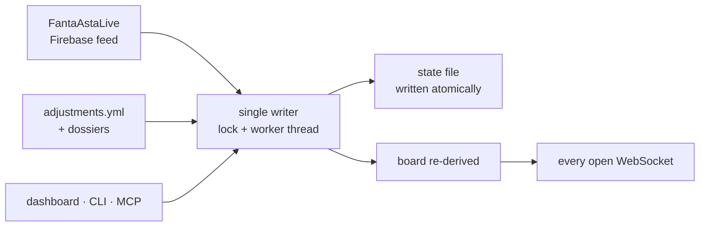

# The auction engine

On auction night one process runs: `fantaclaude asta serve`. It pins a
valuation run, mirrors the room's own auction session from the FantaAstaLive
Firebase feed, and serves the dashboard, the REST API, the WebSocket and the
`fantaclaude-asta` MCP from a single port. It is the only networked command in
the auction toolkit: it subscribes read-only, as exactly one subscriber, and
reconnects with backoff. Every other `fantaclaude asta` command is local.

## One writer

Changes arrive from several directions at once — the admin records a sale, a
fact from the room becomes an adjustment, a command is typed mid-auction — and
any can invalidate the board. So they all converge before anything is
published:

A feed snapshot, an adjustment from any surface and a refresh all take the same
path: one lock, one worker thread, the board re-derived, the state file written
atomically, then a broadcast carrying the whole board to every open WebSocket.
No state change can escape the broadcast, whether it originated with the admin
two seats away or with a command typed mid-auction. While the server runs it is
the one writer of `data/adjustments.yml`; the CLI's `asta adjust` and `asta
refresh` post to it over localhost rather than editing the file behind its
back, and `adjust` falls back to writing directly only when nothing is
listening on the socket.

## The mirror is faithful

The state the server holds is a pure function of the last snapshot: applying
one snapshot describes a state, and comparing it with the state before yields
the events — a pick added, a lot undone, a cost edited, the block moving.
Applying the same snapshot twice is a no-op, and any sequence ends where
replaying only the last one would, which is what makes reconnects and replays
safe without special handling.

Nothing in that path corrects anything. The board shows what the admin
recorded, a mistyped price included — that is his to fix in the session, never
the tool's to quietly repair. Where the mirror does depart from the feed it is
for a reason it can state: credits are derived from the picks rather than read
from the field the feed reports, because that field was observed not to move as
credits were spent; and a team label shaped like an email address becomes the
team id at ingestion, before it can reach a state file, a dashboard or a tool
result.

## Pressure

Beside each band the board shows what beating the room is likely to cost — a
different question from what a player is worth, and never folded into the band.
It is computed per rival. What he can still spend is his credits less one for
each slot he is still obliged to fill, and that difference is his depth. What
he wants comes from his dossier: role classes he avoids or overpays for, clubs
he favours, a cap on any single bid, and whether he spends early or hoards.
What he has actually paid so far scales it, as the ratio of his spending to the
quotazioni of what he bought against the room's. His ceiling is the expected
price times the intent and that ratio, never above his depth; the estimate for
the lot is one credit past the keenest rival's.

## Re-pinning

A player with more than one Mantra role was pinned to a single class when the
run priced him. That pin can be the wrong one by the time he is called: if the
roster already covers the class he was pinned to, he is worth what the roster
still has ranks open for. The live board therefore re-pins every unsold player
against the ranks the current roster leaves open, counting occupancy as an
assignment — each owned player fills one slot, so a three-role man does not
saturate three classes at once. An empty roster re-pins exactly as the run did.

## Auction state is not in the database

The mirrored auction does not live in DuckDB. It lives in memory and in
`data/asta-state.json`, written atomically on every mutation and copied to
`records/` when the auction is closed. That is what makes the split in the
auction MCP clean, as [the MCP servers page](../tools/mcp-servers.md)
describes: the board tools answer
from the in-memory state on the event loop, and the one tool that reaches the
analytical database opens `fanta.duckdb` read-only per call, inside a
threadpool, with a hard row cap — so an analytical scan the model asks for can
never block the WebSocket the room is watching.
