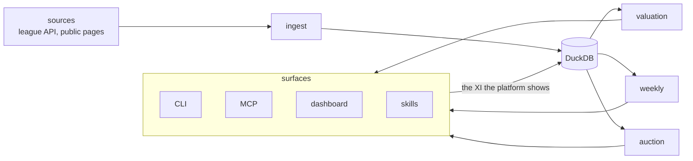

# Architecture

fantaclaude is built around one path that data takes through the system, and
three engines that sit at the end of it:

Every source — the league API, the public pages read for stats and news —
lands through ingest before anything is derived from it. Ingest writes into a
single DuckDB database, which is the one place every engine reads from and
every surface queries through. Three engines sit on top of that store:
[valuation](valuation.md) prices the pool before the auction, the [weekly
engine](weekly.md) forecasts and builds a lineup for the coming giornata, and
the [auction engine](auction-engine.md) prices what is happening live in the
room. Four surfaces expose the result: the command-line interface,
[MCP](../tools/mcp-servers.md), a dashboard, and the Claude Code skills that
drive all of this from a conversation.

The arrow leaving the weekly engine does not end at the surfaces. Once a
lineup is proposed and the giornata is played, the XI the platform actually
shows is read back into the same DuckDB store the forecast was written to —
by hand, or by reading the platform's own page — and it lands in the table
next to the run it followed. That return edge is what lets a forecast be
checked against what actually happened, rather than standing unexamined
until the next one replaces it.

## Two packages, one lockfile

The repository is a uv workspace with two members: `core`, the package
`fantaclaude`, holds the data spine, the CLI and the three engines; `mcp/fantacalcio`,
the package `fantacalcio_mcp`, holds the league API client and the data
logic around it. Both share one `uv.lock` and one `.venv` at the repository
root — there is one dependency set to install and one place it is resolved,
not two packages drifting against each other.

`core` depends on `fantacalcio_mcp` as an ordinary library import, never the
other way around. Where `core` needs to talk to the league API it imports
the client (`fantacalcio_mcp.api.FantacalcioAPI`) directly and calls it
in-process, rather than taking a second network hop through a server built
on the same package. The result is one copy of "what the league API looks
like" — its request shapes, its response models — used by everything that
needs it.

## The dependency direction, and its proof

That direction holds for logic, not only for the network client. Resolving a
matchday — which round of a competition's own calendar matches a given Serie
A giornata — is pure data logic with nothing league-API-specific about it,
so it lives once, in `mcp/fantacalcio`, as plain functions over dicts and
tuples. `core`'s own ingestion of the lineup read-back imports that resolver
rather than keeping a second, independently maintained copy of the same
matching logic. If the dependency ran the other way — the MCP package
reaching into `core` — the same function would need two homes, and the two
would eventually disagree about what a matchday is.
