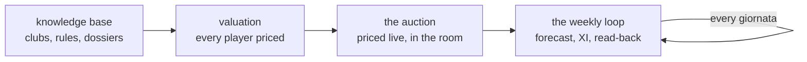

# fantaclaude

fantaclaude is a Claude Code-native assistant built for a single Fantacalcio
Mantra league. It exists to carry one rule all the way through the season:
**Python does the math and the model does the judgment.** Every projection,
every price and every lineup solve is computed by code against data held in a
local database; the model never computes a value itself. Its job is narrower
and more durable than that — it reads what a run produced, and when it has a
reason to disagree, it changes an input rather than the output: a note about
a player, a preference, a fact from the auction room. The number that comes
back afterward is still the code's number, recomputed under the changed
input, and the model's disagreement is on record as the reason for that
input rather than as an edit nobody can trace.

## The season

The same arc repeats every season, and much of it repeats every week within
it:

A knowledge base of club and league facts feeds a valuation that prices every
player in the pool. That valuation is carried live into the auction, re-priced
against the room as it happens. Once a roster exists, the weekly loop takes
over: a forecast for the coming giornata, a lineup built from it, and a
read-back of what actually took the field once the platform has it — closing
the loop the forecast opened.

The rest of this site is organized around that arc, in four sections.

**Architecture** describes how the system is built to support it: the data
spine that turns raw ingestion into a queryable history, the treatment of the
league's own rules as data rather than as assumptions, and the three engines
— valuation, the weekly loop, and the auction — that turn that history into
prices and decisions.

**Using fantaclaude** is written for the operator, not the engineer: for each
moment of the season, which skill to reach for, what it does, and how to read
what comes back. It follows the season end to end, from building the
knowledge base before an auction to the Friday lineup, and closes with the
one pattern that spans every moment in between — arguing with the model by
changing an input, never an output.

**Tools & patterns** covers what is underneath those skills and what of it
could be lifted into another project entirely: the command-line interface,
the MCP servers that expose the league and the auction to Claude, the
contract every ingestion source follows, and the shape of the knowledge base
and the skills themselves.

Together the four sections describe a system built once, for one league, and
kept honest by never letting the model touch a number directly.
