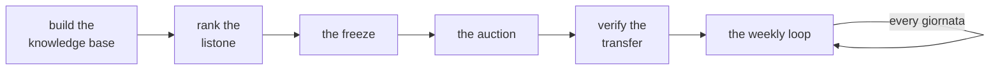

# Using fantaclaude

The two sections before this one describe the system; this one is written to
you, the person running it. Everything from here on is second person, and
most of it reads as a set of steps, because that is what the season actually
is: a handful of recurring moments, each with a skill that owns it.

## The season, once



You build the knowledge base once, at the start of the season, and keep it
current afterward. You rank the listone as the rules and the pool settle,
re-running whenever something changes, until the freeze — the point the
league itself fixes the field — makes one run final. That run prices the
auction, live, in the room. Once the admin has moved the auction into the
league, you verify the transfer against what fantaclaude mirrored, and the
roster it leaves you with becomes the input to a loop that then repeats
every giornata for the rest of the season: a forecast, a lineup, a record of
what you actually fielded.

## The moment and the skill

| Moment | Skill | You say |
| --- | --- | --- |
| The knowledge base is empty or stale | `fanta-kb` | "bootstrap the kb" / "refresh what's expired" |
| Before the auction | `fanta-market` | "rank the listone" |
| Auction night | `fanta-asta` | "what's the board?" |
| Every giornata | `fanta-manager` | "what do I field?" |

You do not need to remember a command to start any of these. You say what is
on your mind, in your own words close to the phrasing above, and the skill
that owns the moment picks up the rest — which mode to run, what to read
back to you, what it needs from you next.

The four pages that follow walk each moment in turn: before the auction,
the night itself, the week, and a page on arguing with the model that cuts
across all three.

## One rule, across all four

**You change inputs; the model never edits an output.** A ranking, a board
and a lineup report are outputs — numbers that code computed from what it
was given, in a run that is now on record. None of them is ever hand-edited,
by you or by the model, no matter how confident anyone is that a number is
wrong.

If you disagree with one, the disagreement has to land somewhere the code
reads it back: a note on a player or a club in the knowledge base, an entry
in `preferences.yml` or `pricing.yml`, an adjustment during the auction, a
note for one giornata's lineup. You write the fact, you say why, and you run
again. The new output is still the code's number — recomputed under what
you changed — and your reasoning is on record as the reason for that input,
not as an edit nobody could trace back to a cause.

That rule is the thread the next four pages keep pulling on. Each page
shows a moment where it would be tempting to shortcut it, and what to do
instead.

??? note "what ran"

    ```
    fantaclaude doctor
    fantaclaude rank
    fantaclaude asta serve --session FA-xxx-xxx
    fantaclaude lineup
    ```

    Full flags: Tools › The CLI.
